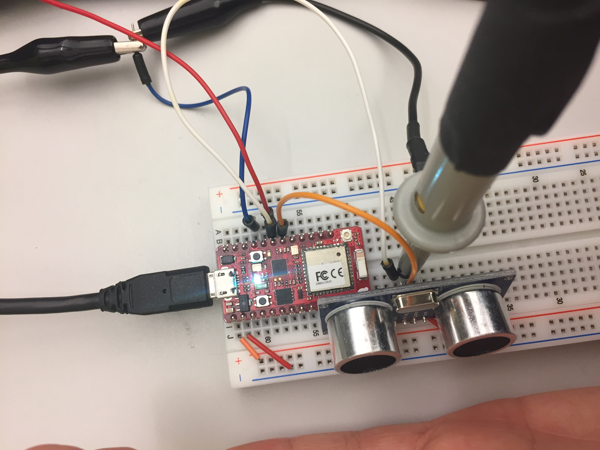

# Angklung


This week we are going to practice the process to upload code to a board, establish a serial communication with a computer, and use a computer to analyze the data from serial port. In addition, this will be our first opportunity to use an oscilloscope, function generator, and power supply to test and understand HC-SR4 sensors.

At the end of the class, we will all play together a [song](http://bit.ly/2fzAcMh) :musical_note: :musical_note: :musical_note::musical_keyboard:.

The project for this week is composed of 4 steps: laboratory equipment, HC-SR4 sensor characterization, HC-SR4 sensor implementation in a development board, and system integration.

## 1. Laboratory Equipment :radio:

This week we will start by using an oscilloscope, function generator, and power supply. They are extremely helpful on hardware design and debugging, so try to practice with them as much as possible :wink:. The following picture shows a typical setup that you will find in an electronics lab.


### DC Power Supply

A DC power supply supplies DC (constant) voltage, or in other words, it supplies electric energy to an electrical load. You can use them to feed and test your sensors and circuits. Today we will use them to generate a 5V supply needed for the HC-SR4 sensor. In order to setup a power supply you need to follow these instructions (see [video](https://youtu.be/oP0IX2d84Nk)):

1. Power supply is turned on
2. Current limit is set appropriately (0.1A)
3. Set your voltages
4. Output is on
5. Positive terminal connected to the appropriate breadboard power rails
6. Negative terminal connected to all breadboard ground rails

Note that you can buy a new DC power supply for ~$30 :dollar: :dollar:.

### Function Generator

A function generator is a device used to generate different types of electrical waveforms over a wide range of frequencies. We will use it today to simulate a trigger signal for the HC-SR4 sensor. To setup a signal follow these instructions (see [video](https://youtu.be/zpEMqZeFxMI)):

1. Positive terminal connected to designated input
2. Negative terminal connected to all breadboard ground rails
3. Port impedance is set to High-Z
4. Output is on
5. Set output waveform is as desired

### Oscilloscope

Oscilloscopes are used to observe and measure variable signal voltages as a function of time. To set up your oscilloscope follow these instructions (for setup see this [video](https://youtu.be/ZjLhh1Y8Asw), and for signal measurement follow this [video](https://youtu.be/t1-gUZGON_E)):

1. Probe ground clips are connected to a breadboard ground rail
2. Voltage and time scales are appropriate and reasonable
3. The green “Run” button is lit up
4. Trigger level is appropriately set
Channel probe type is set to 10X

### Breadboard

Breadboards are for prototyping of electronics. They let you construct a circuit without having to solder the components together. Follow the picture for connection configuration:


## 2. HC-SR4 Sensor Characterization

Before we use the ultrasonic sensor in our final circuit, it’s worthwhile to simply test the sensor to ensure it operates as expected. You can always find details about pin locations/usage and specifications like operating voltages, current limits, and outputs by searching online for a datasheet. For the HC-SR04, there are 4 pins (Vdd, Trig, Echo, Gnd) which should be connected similar to what’s shown in the following image. Vdd(Power) and Ground should be wired to the 5 volts from the Power Supply.


The trigger pin should be connected to a function generator which will supply a square wave. Both the trigger and echo pins should be connected to the oscilloscope so that we can observe them later.


Finally, it is generally a good practice to make sure your grounds are all referencing the same voltage. Multiple grounds in a circuit can sometimes lead to unexpected behavior if not wired properly. Here, the power supply and function generator are crucially using the same ground and additionally the oscilloscope channels are as well.

 Once the sensor is on the breadboard, turn on the power supply output, function generator output, and the oscilloscope. As this [video](https://youtu.be/UqZWHig9Gnw) shows, click the autoscale button. You should see at least the square wave and some signal for the echo. If the echo signal does not display completely on the screen, scale and translate the signal until all of it does. Now both signals should be visible and you can manipulate the duty cycle of the echo signal by moving your hand closer or further to the sensor as shown in this [video](https://youtu.be/BAyzCAeqiWk).


## 3. HC-SR4 Sensor Implementation in a Development Board

Now that you already know how the HC-SR4 sensor works using a oscilloscope, we will implement it using a development board. First, lets understand few things about the board being used. It has different pins, some of them can have different functionalities. The following diagram shows a pin configuration of a redbear duo board (for more information on pins, visit this [link](https://github.com/redbear/Duo/blob/master/docs/duo_introduction.md)):


In this experience we will use few pins:

* VIN: The redbear will be feed by 5V coming from computer using the micro-USB connection. This voltage can be used at the VIN pin connection as well. In our case, we will connect it to the 5V input voltage required by the HC-SR4.
* GND: Ground is needed, so all the sensors are at the same voltage reference. Note that there are two grounds (left and side pins), both of them are actually connected.
* D5: It is a digital I/O (input/output). Digital in the sense that it only read/set a digital high (1 in binary, 3.3V in voltage) or a digital low (0 in binary, 0V in voltage). This will be used as an INPUT from the echo pin of the HC-SR4 sensor.
* D6: Same as D6, but it will be used as an OUTPUT to set the trigger signal on
the HC-SR4 sensor.

Now you can connect them using the following picture (:warning: always connect sensors and wires when circuit is not being feed, e.i. disconnect supply while you connect other stuff :warning:):



Once everything is connected you can upload the following [code](https://github.com/jpduarteeecs/hardwaremakers/blob/master/ultrasonic/HC_SR4_Demo/HC_SR4_Demo.ino), which only trigger a signal for the HC-SR4, we are not yet measuring distance:

```Arduino
#if defined(ARDUINO)
SYSTEM_MODE(MANUAL);
#endif

#define trigPin D6 // Trig pin on the HC-SR04

void setup() {
  pinMode(trigPin, OUTPUT);
}

void loop() {
  digitalWrite(trigPin, HIGH);
  delay(5);
  digitalWrite(trigPin, LOW);
  delay(5);
}
```

You need to understand few things from the previous code:

* For now, ignore the `#if defined(ARDUINO)` part. It indicates how code is being loaded. This time we load it using serial port, it can be also loaded wireless!.
* `void setup()` is run once, only at the beginning of the code. It is used to set several things, in this case, pin and serial communication.
* `pinMode(trigPin, OUTPUT);` sets the pin trigPin as an OUTPUT
* `void loop() ` this part of the code indicates a loop that is going to constantly execute while code is running.
* `digitalWrite(trigPin, HIGH);` is setting the output pin trigPin to a high value (3.3V).
* `digitalWrite(trigPin, LOW);` is setting the output pin trigPin to a low value (0V).
* `delay(5);` delay function is used to stop the executing of the code for a given amount of milliseconds, in this case, 5ms.

In order to read the distance sensor by the HC-SR4 and transmit it using serial communication, upload the following [code](https://github.com/jpduarteeecs/hardwaremakers/blob/master/ultrasonic/HC_SR4_Demo_serial/HC_SR4_Demo_serial.ino):

```Arduino
#if defined(ARDUINO)
SYSTEM_MODE(MANUAL);
#endif

#define trigPin D6 // Trig pin on the HC-SR04
#define echoPin D5 // Echo pin on the HC-SR04

unsigned long distance;

void setup() {
  Serial.begin (9600);
  pinMode(trigPin, OUTPUT);
  pinMode(echoPin, INPUT);
}

void loop() {
  digitalWrite(trigPin, HIGH);
  delayMicroseconds(500);
  digitalWrite(trigPin, LOW);
  distance = pulseIn(echoPin,HIGH);
  Serial.println(distance);
  delay(500);
}
```

It is very similar to the first code but you need to understand few new things from the previous code:

* `Serial.begin (9600);` this set the serial communication rate. The same rate need to be set when you want to read it using your python code or any other serial display.
* `delayMicroseconds(500);` this function set a delay but in microseconds, in this case, 500us.
* `distance = pulseIn(echoPin,HIGH);` pulseIn function measure the width (time length of a signal being hight) of signal in microseconds. For a more detailed explanation visit particle photon [documentation](https://docs.particle.io/reference/firmware/core/#pulsein-).
* `Serial.println(distance);` prints the value obtained from the sensor to the serial port communication.

Now [open your serial terminal](https://youtu.be/2JImBb9YLdg?t=4m43s) in the Arduino IDE, and you can see how the sensor measure the distance.

## 4. System Integration

We know how the sensor works, how the development board can read and transmit data from the sensor, and how to create sounds (from [previous week](https://github.com/jpduarteeecs/hardwaremakers/blob/master/labs_sp17/introduction/intro.md) experience). Using a code for the develptment board and a code in python we can create a simple Angklung instrument:

### Development Board Code:

Upload the following [code](https://github.com/jpduarteeecs/hardwaremakers/blob/master/labs_sp17/angklung/angklung_redbear/angklung_redbear.ino) in the redbear duo. This code average 10 sensor data measurements and transmit it using serial port. In addition, it does not transmit data if `inByte` variable is set to 0. This variable is set by the python code and transmitted using serial communication. This is needed when a note is played, so not extra data is transmitted while this happens. Once note is played already, serial communication is active again.

```Arduino
#if defined(ARDUINO)
SYSTEM_MODE(MANUAL);
#endif

#define trigPin D6 // Trig pin on the HC-SR04
#define echoPin D5 // Echo pin on the HC-SR04

unsigned long distance;
unsigned long distance_sum=0;
unsigned long count=0;
unsigned long sample_number=10;
char inByte = '1';

void setup() {
  Serial.begin (9600);
  pinMode(trigPin, OUTPUT);
  pinMode(echoPin, INPUT);
}

void loop() {
  //#################################sensor begin#####################
  digitalWrite(trigPin, HIGH);
  delayMicroseconds(500);
  digitalWrite(trigPin, LOW);
  distance = pulseIn(echoPin,HIGH);
  //#################################sensor end#######################

  if (inByte=='1') {
    if (count<sample_number) {
      count+=1;
      distance_sum+=distance;
    } else {
      Serial.println(distance_sum/sample_number);
      inByte = '0';
      count = 1;
      distance_sum=0;
    }

  }

  //#################################data from computer begin#######################
  if(Serial.available()){ // only send data back if data has been sent
    inByte = Serial.read(); // read the incoming data
  }
  //#################################data from computer end#######################

}
```

### Python Code:

Use the following python [code](https://github.com/jpduarteeecs/hardwaremakers/blob/master/labs_sp17/angklung/angklung_python.py) to read data from development board and play musical notes. If you were able to finish last week experience, this code should run fine in your computer. There are few things you need to understand/change from the code:

* `path = "/home/juan/research/hardwaremakers/labs_sp17/angklung/mp3files/"` you need to update the path to the one in your computer.
* `fname = path+"low_do_long.mp3"` change this to play another note.
* `ser = serial.Serial('/dev/ttyACM0', 9600) ` you need to change the serial port address. Use the same one that you set in the Arduino IDE.
* `while True:` this let us keep running the code continuously.

```Python
from time import sleep #this library allows us to make stop in the execution of the program
import serial #this library is to connect using serial port, library pyserial is needed for this
from pydub import AudioSegment
from pydub.playback import play
import time

#Mina Azhar (Juan's wife) did all the mp3 conversion, thank you!
path = "/home/juan/research/hardwaremakers/labs_sp17/angklung/mp3files/" #change to your own path
fname = path+"low_do_long.mp3" #change to another note as needed
note = AudioSegment.from_mp3(fname)

ser = serial.Serial('/dev/ttyACM0', 9600) # Establish the connection on a specific port, for windows use COMX with X the port number

ser.write(str.encode('1')) #this let redbear duo to continue sending data

while True:#we use a "while True:" so the serial connection is always open

    #ser.write(bytearray(struct.pack("f", 5.1)))
    bytes_from_serial = ser.readline() #read serial, return a byte result
    print (bytes_from_serial.decode("utf-8") ) # print in serial form, it transform the byte data to string

    value_sensor = int(bytes_from_serial.decode("utf-8") ) #transfor data to a int number

    if (value_sensor<1000 ): #only distance signal less than 1000us
        ser.write(str.encode('0')) #this stop the redbear duo from sending new data
        play(note[:int(note.duration_seconds*value_sensor)]) #play sound
        ser.write(str.encode('1')) #this let redbear duo to continue sending data
    else:
        ser.write(str.encode('1')) #this let redbear duo to continue sending data
```        

We will try "Mary had a little lamb":


# Acknowledgment

The material of today's experience was designed and tested by Juan Duarte, Ram Menon, Thomas Habib, Kunal Gosar, and Tom Osborn.
