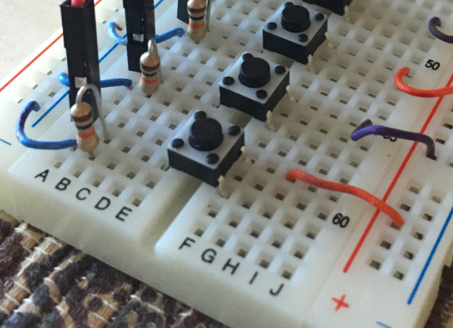
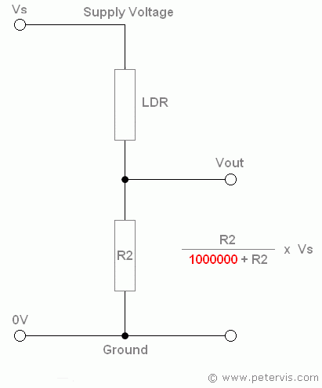
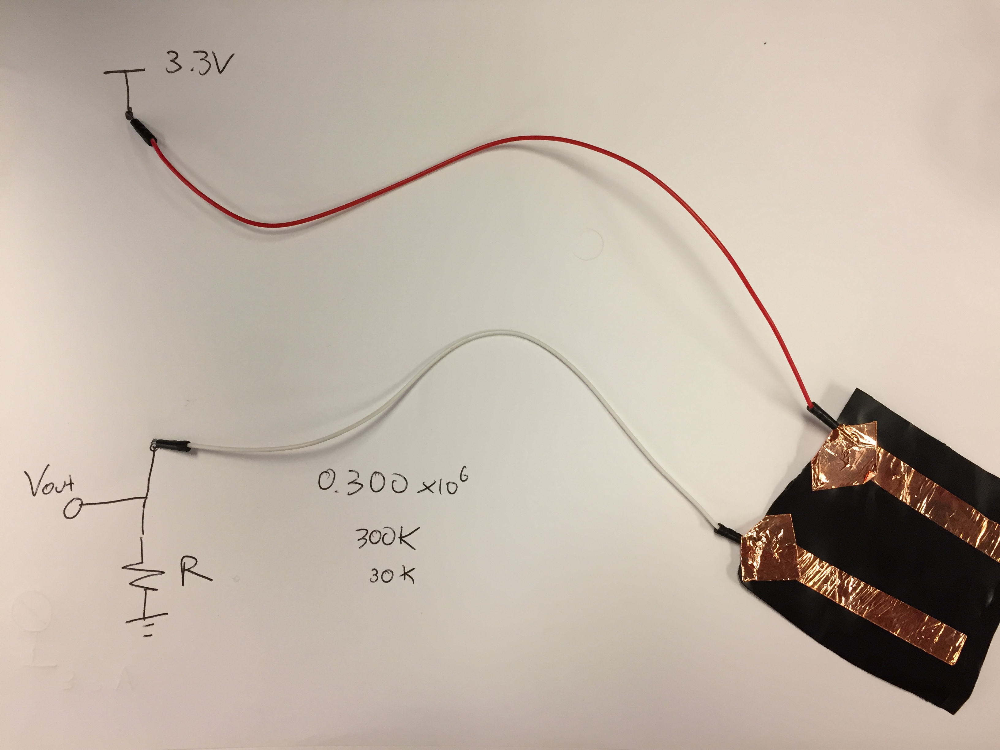

# Reaction Measurement

This week we will measure the reaction time of our brains/hands by constructing a switch.

## Constructing a Switch

In order to construct a switch we will use a voltage divider. A voltage divider is a circuit that produces an output voltage (Vout) that is a fraction of its input voltage (Vin). Voltage division is the result of distributing the input voltage among the components of the circuit.


A voltage divider circuit can be connected to one of the digital D0-17 ports. Using them, we can read `True` (0V) and `False` (3.3V) values from those circuits.


A digital pin can be configured as an INPUT, INPUT_PULLUP, INPUT_PULLDOWN or OUTPUT. In the INPUT_PULLUP configuration the pin reminds at a high value until it is pulled down by an external circuity. In the opposite manner, In the INPUT_PULLDOWN configuration the pin reminds at a low value until it is pulled up by an external circuity.

Connect one switch to D0 port:



Then and try the following [code](https://github.com/jpduarte/idd-examples/blob/master/redbearduo/examples/button_pullup/button_pullup.ino) with an INPUT_PULLUP configuration:

```Arduino
#if defined(ARDUINO)
SYSTEM_MODE(MANUAL);
#endif

// PIN EXAMPLE
// EXAMPLE USAGE
int button = D0;                      // button is connected to D0  and GND
int LED = D7;                         // internal LED is connected to D7

void setup()
{
  pinMode(LED, OUTPUT);               // sets pin as output
  pinMode(button, INPUT_PULLUP);    // sets pin as input
}

void loop()
{
  // blink the LED as long as the button is pressed
  while(digitalRead(button) == LOW) {
    digitalWrite(LED, HIGH);          // sets the LED on
    delay(50);                       // waits for 200mS
    digitalWrite(LED, LOW);           // sets the LED off
    delay(50);                       // waits for 200mS
  }
}
```
Then, use this [code](https://github.com/jpduarte/idd-examples/blob/master/redbearduo/examples/button_pulldown/button_pulldown.ino) in your redbear duo, which has an INPUT_PULLDOWN configuration:

```Arduino
#if defined(ARDUINO)
SYSTEM_MODE(MANUAL);
#endif

// PIN EXAMPLE
// EXAMPLE USAGE
int button = D0;                      // button is connected to D0 and 3V3
int LED = D7;                         // LED is connected to D7

void setup()
{
  pinMode(LED, OUTPUT);               // sets pin as output
  pinMode(button, INPUT_PULLDOWN);    // sets pin as input
}

void loop()
{
  // blink the LED as long as the button is pressed
  while(digitalRead(button) == HIGH) {
    digitalWrite(LED, HIGH);          // sets the LED on
    delay(50);                       // waits for 200mS
    digitalWrite(LED, LOW);           // sets the LED off
    delay(50);                       // waits for 200mS
  }
}
```

Note that is you want to incorporate a switch into your future project, you need to take care of debounce effect (see this [video](https://www.youtube.com/watch?v=jYOYgU2vlSE) for more information). You can use different examples to take care of this effect: [button_debounce](https://github.com/jpduarte/idd-examples/blob/master/redbearduo/examples/button_debounce/button_debounce.ino), [button_interrupt](https://github.com/jpduarte/idd-examples/blob/master/redbearduo/examples/button_interrupt/button_interrupt.ino), or [button_interrupt_debounce](https://github.com/jpduarte/idd-examples/blob/master/redbearduo/examples/button_interrupt_debounce/button_interrupt_debounce.ino).

We can also use the analog A0-7 pins and read the actual value of a voltage divider. This can be useful for several sensing applications like pressure sensor, of photo-detection:



## Pressure Sensor

We will use a velosat conductive material for this sensor. This material is pressure-sensitive, if you squeeze it will reduce the resistance, so it's very useful for making flexible sensors.


Cute a piece of 5cmx5cm, add two copper lines, and attach two wires to it, as indicated in the following picture:



To construc the circuit with the velosat sensor, you need to choose your resistance R. First, measure the resistance of your sensor without pressure (Rsensor_high), then while you apply pressure (Rsensor_low). For the sensor shown in the previous figure, Rsensor_high=300kOhm and Rsensor_low=30kOhm. Then using Vin=3.3V and R=100kOhm, we will obtain Vout_hight=3.3V*100kOhm/(30kOhm+100kOhm)=2.5V and Vout_low=3.3V*100kOhm/(300kOhm+100kOhm)=0.8V which can be considered as HIGH and LOW values for logical proposes.


## Reading Pressure Sensor Values

You use the following code to read and display in the serial monitor the values of the readings.

```Arduino
#if defined(ARDUINO)
SYSTEM_MODE(MANUAL);
#endif

int LED = D7;                         // LED is connected to D7
int analog_read = A1;
int analog_value;

void setup() {
  Serial.begin (9600);
  pinMode(LED, OUTPUT);               // sets pin as output
  pinMode(analog_read, INPUT);  
}

void loop()
{
 analog_value = analogRead(analog_read);
 Serial.println(analog_value);
 delay(100);
}
```
