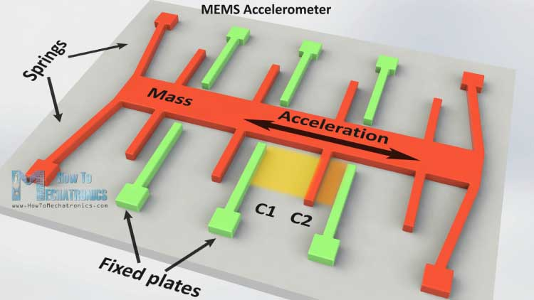

# Sensor 1: Accelerometer Sensor

In today experience we will learn how to use an accelerometer sensor. We are using the sensor [MPU-6050](https://www.invensense.com/wp-content/uploads/2015/02/MPU-6000-Register-Map1.pdf), it is a 6-axis MotionTracking device that combines a 3-axis gyroscope, 3-axis accelerometer, and a Digital Motion Processor™ (DMP) all in a small 4x4x0.9mm package. 

Today we will focus only in the accelerometer part (next week in gyro). An accelerometer is a device that measures the proper acceleration. This is not the same as coordinate acceleration (rate of change of velocity). For example, an accelerometer at rest on the surface of the Earth will measure an acceleration due to Earth's gravity, straight upwards (by definition) of g ≈ 9.81 m/s2. By contrast, accelerometers in free fall (falling toward the center of the Earth at a rate of about 9.81 m/s2) will measure zero.

An accelerometer can be implemented by measuring the change in capacitance of a MEMS device. A MEMS (Microelectromechanical systems) micro structure can looks like [this](http://howtomechatronics.com/how-it-works/electrical-engineering/mems-accelerometer-gyrocope-magnetometer-arduino/):

It has a mass attached to a spring which is confined to move along one direction and fixed outer plates. So when an acceleration in the particular direction will be applied the mass will move and the capacitance between the plates and the mass will change. This change in capacitance will be measured, processed and it will correspond to a particular acceleration value.

## References

* [Arduino Accelerometer & Gyroscope Tutorial MPU-6050 6DOF Module](https://www.youtube.com/watch?v=M9lZ5Qy5S2s)
* [MPU-6050 6dof IMU tutorial for auto-leveling quadcopters with Arduino source code](https://www.youtube.com/watch?v=4BoIE8YQwM8)
