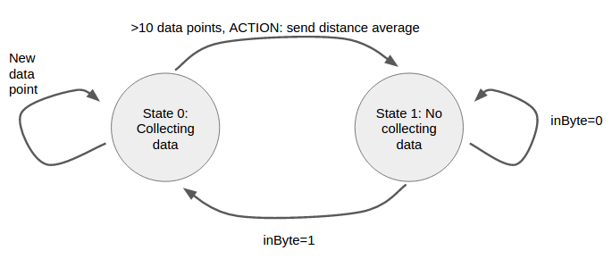

# Finite State Machines

This week we are going to learn and practice a method to make your hardware in a well organize way: finite state machines.

A Finite state machines (FSM) gives an abstract organization to your hardware. FMS consists of several states, where a given state is chosen in responds to external inputs. Outputs of the systems depends on which state it is and in the external inputs as well.

:zap::zap:From now on, We want you to do all your hardware design using this!! :speak_no_evil::speak_no_evil: (or at least try...)

# Example 1: Turnstile Finite State Machine :suspension_railway: (wikipedia example)

Turnstiles are very simple example that can be modeled using a finite state machine. Once user deposit a coin (or ticket) the turnstile should unlock its arms, allowing a single user to pass. After the user passes through, the arms must be locked again until next users deposit a new coin (ticket).

There are basically two states: locked and unlocked. The inputs for the systems are: deposit a coin, push the turnstile arm. Based on these constrains we can develop the following state diagram:

The functionality can be also summarized in the following table:

|  Current State |   Input|  Next State |  Output |
|---|---|---|---|
|  Locked | coin  | Unlocked  | Unlocks the turnstile so that the customer can push through.  |
|  Locked |  push | Locked  |  None |
|  Unlocked | coin  | Unlocked  | None  |
| Unlocked |  push  |  Locked | When the customer has pushed through, locks the turnstile.  |

# Example 2: Angklung Finite State Machine :musical_note::musical_note:

During last experience we uploaded a [code](https://github.com/jpduarteeecs/hardwaremakers/blob/master/labs_sp17/angklung/angklung_redbear/angklung_redbear.ino) in the redbear duo to control the angklung functionality. The code averaged 10 sensor data measurements and transmit it using serial port. In addition, it did not transmit data if `inByte` variable is set to 0. That variable was set by the python code and transmitted using serial communication. That was needed when a note is played, so not extra data is transmitted while this happens. Once note was played, serial communication was active again.

The previous explanation is quite confusing, the code as well. Let's make this implementation cleaner by using a state machine.

First, in a similar manner as the turnstile finite state machine, lets define inputs, outputs, and states.

Inputs:

* Data from HC-SR4 Sensor: `distance`
* Data from computer transmitted using serial port: `inByte`

Outputs:

* Data to computer, using serial port: `distance`

States:

* Collecting data: averaging 10 data points
* No Collecting data: waiting until collection is allowed

Using the previous information, we can draw a simple state machine for the angklung:

