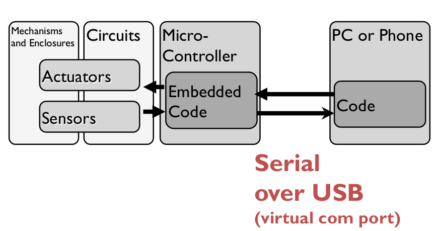
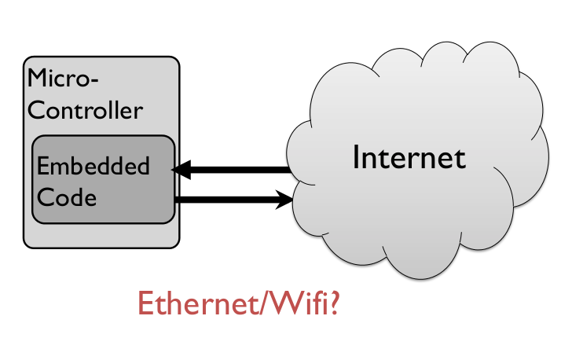
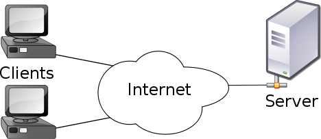
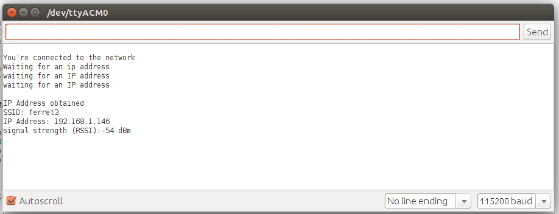
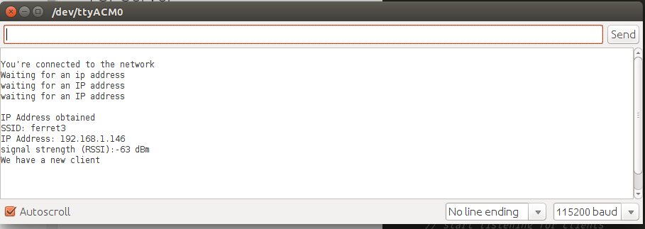
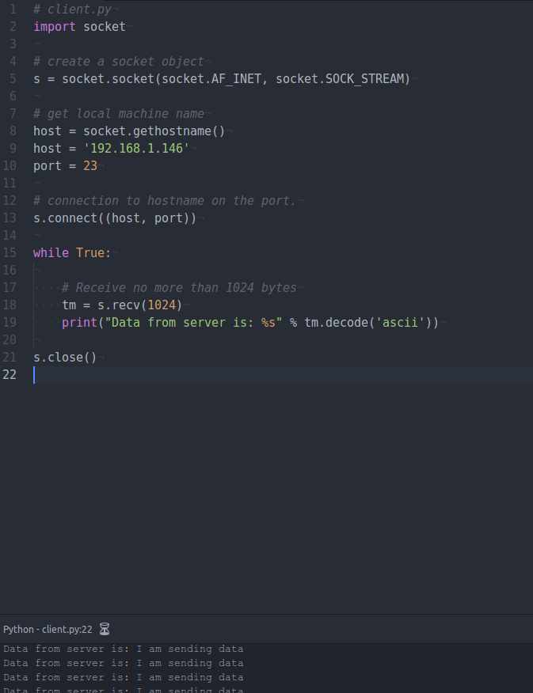

# Connecting Hardware Wireless: Wifi

So far we have been connecting our hardware using wires! All previous labs have been using [serial communication](https://www.youtube.com/watch?v=JJZOTtwpAjA). Indeed, sensors were connected directly to our development board, which sampled the data, and then delivered it to our computers, as the following diagram shows (from [Interactive Device Design](https://bcourses.berkeley.edu/courses/1376830) course):



Today we are going to learn how to establish a wireless communication between your hardware. Depending on what kind of hardware we want to connect, there are several options to achieve wireless communications:  
* XBee Radios
* nRF24L01
* Infrared
* Audio
* Bluetooth
* Wifi

Using one of the previous examples, we can establish the following framework for our hardware implementation (diagram [reference](https://bcourses.berkeley.edu/courses/1376830)):


Where extra services in the cloud can be used, for storing, sharing, and computing data.

Another options is to have your hardware connected directly using WiFi (diagram [reference](https://bcourses.berkeley.edu/courses/1376830)):



## WiFi for Server-Client Model

WiFi is a communication technology for wireless local area networking. It can be use for a Server-Client model, which is a distributed application structure that distributes tasks between servers (offer or deliver a particular service) and clients (request particular service).



For exampple, a printer can be a server which is connected to a wireless network. Then, a computer, the client, send a request to the server, which print your work:


## Creating a Server in a RedBear Duo

We want to send data from our hardware to our PCs. There are several ways to create server-client frameworks that can do this. Today, we will create a server in the RedBear duo that deliver data to any client that connect to it (a client can be coming from your computer or another development board).

Using WiFi technology, available in RedBear Duo and Particle Photon boards, we will connect to a local network. Then, we will create a local server.

Compile and upload the following code to your RedBear Duo board:


```Arduino
#if defined(ARDUINO)
SYSTEM_MODE(SEMI_AUTOMATIC);
#endif

// your network name also called SSID
char ssid[] = "juanito";
// your network password
char password[] = "holahola";

//You choose the number, in this case 23
TCPServer server(23);

boolean alreadyConnected = false; // whether or not the client was connected previously

void printWifiStatus();

void setup() {
  //Initialize serial and wait for port to open:
  Serial.begin(115200);
  // attempt to connect to Wifi network:
  Serial.print("Attempting to connect to Network named: ");
  // print the network name (SSID);
  Serial.println(ssid);

  // Connect to WPA/WPA2 network. Change this line if using open or WEP network:
  WiFi.on();
  WiFi.setCredentials(ssid,password);
  WiFi.connect();

  while ( WiFi.connecting()) {
    // print dots while we wait to connect
    Serial.print(".");
    delay(300);
  }

  Serial.println("\nYou're connected to the network");
  Serial.println("Waiting for an ip address");

  IPAddress localIP = WiFi.localIP();
  while (localIP[0] == 0) {
    localIP = WiFi.localIP();
    Serial.println("waiting for an IP address");
    delay(1000);
  }

  Serial.println("\nIP Address obtained");

  // you're connected now, so print out the status:
  printWifiStatus();

  // start the server:
  server.begin();
}


void loop() {
  // wait for a new client:
  TCPClient client = server.available();

  // when the client sends the first byte, say hello:
  if (client) {
    if (!alreadyConnected) {
      // clead out the input buffer:
      client.flush();
      Serial.println("We have a new client");
      client.println("Hello, client!");
      alreadyConnected = true;
    }

    while (client.connected()){
      client.printf("I am sending data\r");
      delay(33);
    }
  }

}

void printWifiStatus() {
  // print the SSID of the network you're attached to:
  Serial.print("SSID: ");
  Serial.println(WiFi.SSID());

  // print your WiFi shield's IP address:
  IPAddress ip = WiFi.localIP();
  Serial.print("IP Address: ");
  Serial.println(ip);

  // print the received signal strength:
  long rssi = WiFi.RSSI();
  Serial.print("signal strength (RSSI):");
  Serial.print(rssi);
  Serial.println(" dBm");
}
```
There are several parts that you need to understand from the previous code, head, setup, and main loop:

### Head Code

* We defined the name of the network and password using `ssid[]` and `password[]`, respectively
* A server was created to listen to port 23. `TCPServer` function was used, for details read [this](https://docs.particle.io/reference/firmware/photon/#tcpserver).

### Setup Part

* WiFi was turned on, setup and connected using `WiFi.on()`,`  WiFi.setCredentials(ssid,password)`, and `WiFi.connect()`.
* Local IP is obtained using `WiFi.localIP()`. This address you need to later connect your client to this server.
* Server was started using `server.begin()`

### Loop Part

* The code define a client using `TCPClient client = server.available()`
* `if (client)` checks if a client is connected
* `while (client.connected())` makes the code to interact with client while it is connected.
* `client.printf("I am sending data\r");` it prints to the client a string. Note that this can be data from your sensor or any information you want to send to your client.

Open your serial monitor, it should look similar to this (SSID and IP should be different base on your network):



Now you are ready to create a client and connect to this server.

## Client in Python

 There are so many programming languages that can be use to create a server. We are going to use Python this time, but feel free to use whatever you want. A simple reference to code server-client in python can be found [here](http://www.bogotobogo.com/python/python_network_programming_server_client.php). Using this reference, we modified it to create a client that communicate to the server in our Redbear Duo:

 ```Python
 # import socket library
 import socket

 # create a socket object
 s = socket.socket(socket.AF_INET, socket.SOCK_STREAM)

 # Host is the IP of server to connect, you can check this IP when you start your server connection in your redbear duo
 host = '192.168.1.146'
 #Port is the one you defined in your server
 port = 23

 # connection to hostname on the port.
 s.connect((host, port))

 while True:

     # Receive no more than 1024 bytes
     tm = s.recv(1024)
     print("Data from server is: %s" % tm.decode('ascii'))

 s.close()
 ```

 Run the previous python code. There are two things you should be able to check. First, the serial monitor of your RedBear Duo should indicate a new client is being connected:



 Second, the console should start to receive data from the server:

 

This is all for today, you can modify your code to measure some sensor and send the data back and do something with that data in your computer. Next class we will create a server in your pc and client in your board, in addition to read some sensor data.

## Acknowledgment
The material of today's experience was designed and tested by Juan Duarte, Ram Menon, and Thomas Habib.
